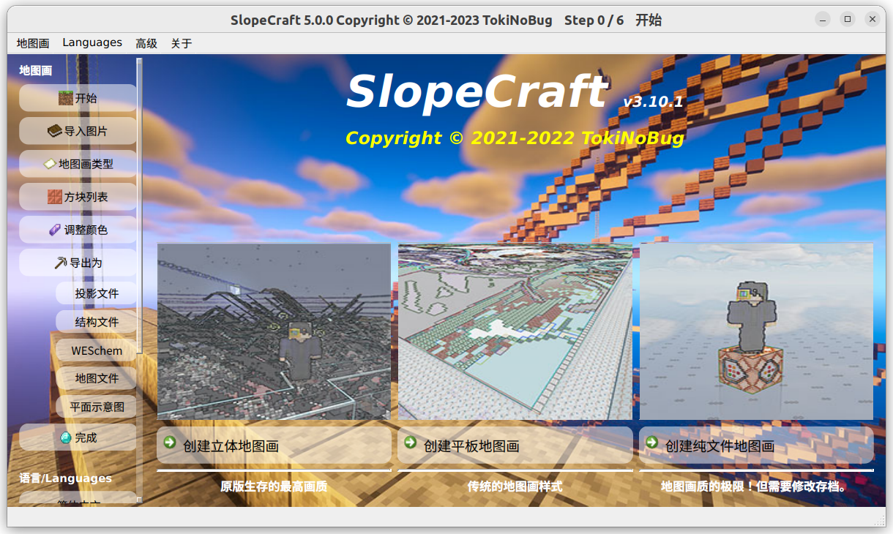
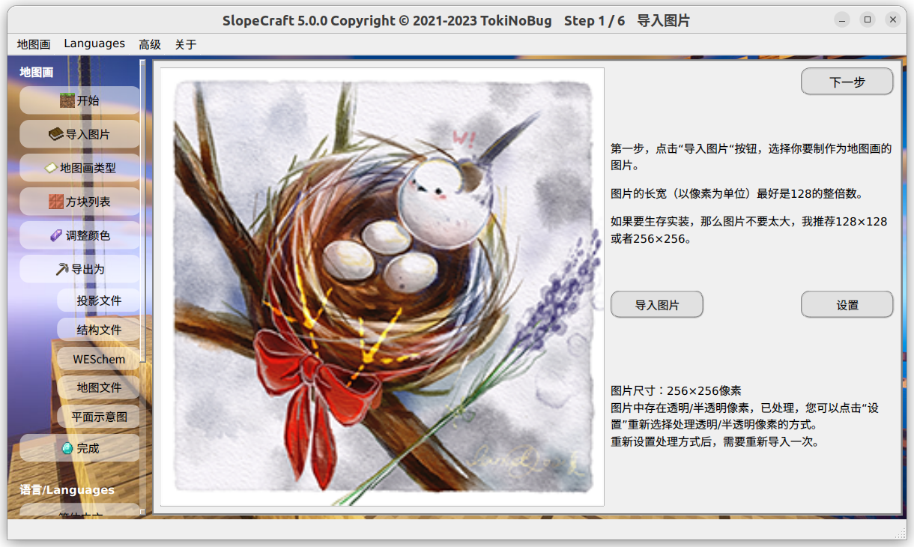
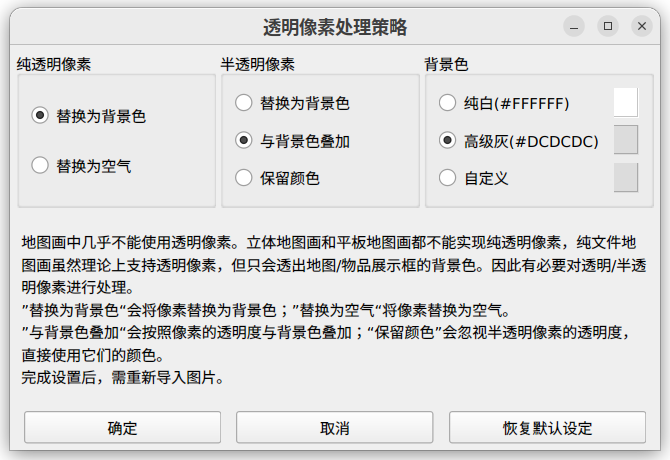
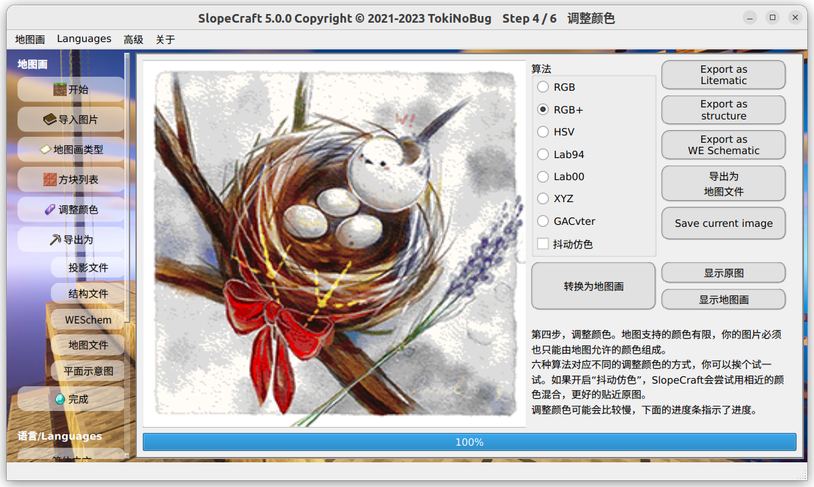
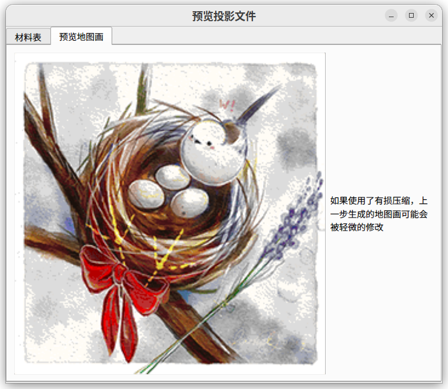
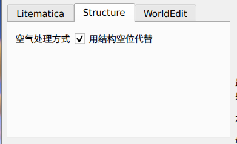
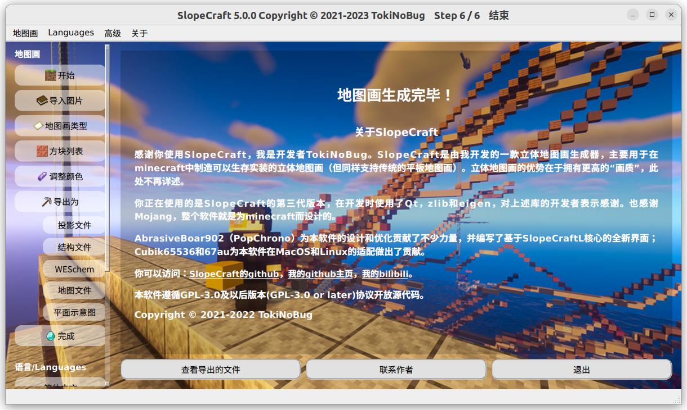

# SlopeCraft 使用教程

这个文档将会告诉你如何使用 SlopeCraft 创建立体、平板和纯文件地图画。

在菜单栏的 Languages 下拉菜单中你可以找到切换语言的选项。

## Step -1. 图片预处理

首先，准备好你想要制作成地图画的原图

用 ps 或者其他可以编辑图片的软件，**将它的长宽缩放到 128 像素的整倍数**。

这里我将图片缩放到 256×256 像素，这恰好是 2×2 地图的大小。

(调整大小**不是强制的**，SlopeCraft 也不包含缩放图片的功能，但我很建议这样做)

将这张图片保存好。

## Step 0. 设置地图画类型

双击启动 SlopeCraft.exe，你将会看到如下的界面。

   

这里需要你选择**地图画的类别**：

- 如果你想要**颜色尽量丰富**、**画质尽量精致**的地图画，最好点击左侧的**创建立体地图画**按钮。
- 如果你想要传统的平板地图画，不太在意地图画的画质，那么请点击中间的**创建平板地图画**按钮。
- 如果你不需要让地图画在游戏中以方块的形式存在，只需要让它显示于地图、并能被贴在物品展示框中，那么请点击右侧的**创建纯文件地图画**按钮。

请注意，这种纯文件地图画在使用时至少需要替换存档中的文件，有可能还需要使用命令。一般只适用于单机游戏，如果你是服务器管理员也可以。

这里我选择了立体地图画。

## Step 1. 导入图片

在第二页，点击**导入图片**就可以导入预处理后的图像。、

但如果你的原图有透明或半透明像素，那么你应该先点击**设置**按钮，设置透明像素的处理策略：

透明像素处理策略有不同的方法处理纯透明像素（alpha=0）和半透明像素（alpha>0）。纯透明像素要么替换为背景色，要么设为空气；半透明像素既可以替换为背景色，也可以与背景色叠加融合，还可以忽略掉它的透明度属性，直接当做不透明像素。另外也可以设置背景色，默认背景色是雪块平铺时的浅灰色，也可以选择纯白色，或者任何自定义颜色。

**请注意：如果你要按照自定义的策略导入含全透明/半透明像素的图片，务必先设置透明像素处理策略，后导入图片！否则图片只会按照默认的处理策略处理！如果已经导入了图片才重新设置处理策略，请重新导入图片。**

点击**导入图片**，在弹出的文件选择框中找到刚刚调整好的图片。看一下下面橙色框中显示的**图片尺寸**，确认自己没有选错图片。

如果没有 bug，那么这张图片会在左侧显示出来。

导入图片成功后，点击**下一步**。

**前往下一步的按钮固定在右上角，以后的图片中不会再特别标出。**

## Step 2. 选择版本，确认地图画类型

在这一页，你需要设置地图画对应的**游戏版本**。

目前从 1.12～1.19 都是支持的，我会继续跟进更新的版本，但不会支持 1.12 以前的老板本。

需要注意，1.12~1.15 版本的地图画的“画质”没有区别，平板地图画有**51 色**，立体地图有**153 色**。1.16 为阴间树增加了 7 种基础颜色，所以平板地图画可以使用**58 色**，立体地图画则可以使用**174 色**。1.17 增加了深板岩、生铁块和发光地衣的颜色，因此平板可以使用 **61 色**，立体地图画可以用 **183 色**。

_吐槽：Mj 为啥要给阴间树这么多颜色？多来点肉色不好吗？_

确认无误后点击下一步。

## Step 3. 设置方块列表

方块列表其实就是一个地图画的“**材料表**”，或者“**调色盘**”。**它决定了地图画的调色盘中一共有哪些颜色，每种颜色又对应哪种方块。**

这个页面比较复杂，我将依次介绍每个部分。**（其实一般来说，方块列表都不太需要自己调整）**

滑动区内显示了每一种基础颜色。在**启用**框中，你可以勾选**是否允许 SlopeCraft 使用这种颜色**。默认情况下，每种基础颜色都会被勾选（1.16 中新增的颜色在更低版本除外）

启用框的下方是**每一种颜色所对应的方块**。调色盘中的每一种颜色都只能使用一种方块。

- 你可能认为图中很多方块的颜色不同，但请注意，**它们在“地图的眼睛”里是完全相同的**，选择的唯一依据就是方块是否容易量产。
- 有些基础颜色只有一种方块可用，然而调色盘不能空缺，所以这个选项是不可更改的，就像图中的玻璃或绿宝石块，它必须被选中。

左上角有四种预设的方块列表可供选择：

- Vanilla 是“**原汁原味**”的，尽量使用每种颜色“原先的方块”。它比较适合创造模式，不适合生存实装
- Cheap 极力选择**最便宜的方块**，保证每种方块都是可以量产的。它适合生存前期。
- Elegant 是在可以生存实装的情况下，尽量选择“**最优雅的方块**”，比如尽量选择小黑偷不走的、既好看又不太难量产的方块。这是默认的选项。
- Shiny**专为光影而生**，它尽量选择发光的方块，力求在光影中足够绚丽。
- Custom 则代表你使用了**自定义**的方块列表。
  
左下角的**优先使用混凝土**等按钮方便批量操作，意思很明显，不再多解释。

完成这些设置之后，点击确认。**在“下一步”按钮的左侧，会显示这张地图画可以使用多少种颜色。**如果你禁用了某些基础颜色，那么这个数量会减少一些。**所以调色盘越丰富，地图画尺寸越大，画质就越好。**

点击确认后，前往下一步。

## Step 4. 转化图像

完成上述前置工作后，我们该进入正餐了：将图像转化为地图画。

**调整图片**按钮会将图像的颜色调整为地图画的调色盘中可以使用的颜色，而下面的**显示原图**和**显示调整后图像**分别显示原图和调整后的地图画，方便你对比。

上面的颜色空间有 7 种选项，**代表 7 种调整颜色的方式。**
前六个转化算法分别对应着六种不同的色差公式。算法中 RGB+最为推荐，RGB 和 XYZ 速度最快，Lab94 和 Lab00 效果较好但性能较慢，HSV 效果一直不太理想，不太推荐。GACvter 是最慢的，但如果前 6 种算法效果都不满意，不如试试它。

前 6 种算法只考虑像素的颜色，不考虑像素空间位置，它们称之为传统算法。而第 7 种算法 GACvter 则以前 6 种算法生成的结果作为“种子”，在其基础之上寻找边缘轮廓更贴近原图的解。这个新算法同时考虑像素颜色和位置，是智能算法。

对于同一张图像，这 7 种调整方式的效果都是不同的。

我们都希望地图画与原图尽量接近，所以你可以依次试一下每一种调整方式，通过两个按钮来回比较，选出调整效果最好的一种。

|  |  |
| :-------------------------------------------------------------------------: | :-------------------------------------------------------------------------------: |
|                                   转化前                                    |                                      转化后                                       |

调整图片的过程可能会比较慢，尤其是对于比较大的图片。**如果进度条突然停滞不前，甚至窗口未响应，请不要关闭窗口，什么都不用做，耐心等待即可。**调整图片的过程有大量的计算任务，卡顿是正常的。

### GACter

GACter 使用遗传算法（GA），你可以设置它的参数，只需点击**高级功能**菜单下的 **Ai 转化器参数**。

如果你了解 GA，那这些参数不需要解释。如果不了解，百度一下，或者干脆别动它。

唯一需要解释的参数就是**最大提前收敛代数**，它指的是最大允许的连续寻优失败代数。举个例子，如果它的值是 50 代，那么当算法连续 50 代没有找到更优秀的解时，算法终止，节省时间。更大的**最大提前收敛代数**可以避免算法早熟，但会让它更慢。

在选出了你认为最好看的地图画之后，就要进入生成地图画的最后一步了：**导出**。

## Step 5. 导出

导出有 6 种类型，以下的表格记录了各种地图画类型与导出类型之间的关系。

|            导出类型             | 立体地图画 | 平板地图画 | 纯文件地图画 |
| :-----------------------------: | :--------: | :--------: | :----------: |
| Litematica 投影（\*.litematic） |     ✔      |     ✔      |              |
|   原版结构方块文件（\*.nbt）    |     ✔      |     ✔      |              |
|      WE 原理图（\*.schem）      |     ✔      |     ✔      |              |
|     地图数据文件（\*.dat）      |     ✔      |     ✔      |      ✔       |
|   转化后图像（\*.png \*.jpg）   |     ✔      |     ✔      |      ✔       |
|   平面示意图（\*.png \*.jpg）   |            |     ✔      |              |

**注意：WE 原理图（\*.schem）只支持 1.13+版本，在 1.12，WE 使用 \*.schematic 后缀的旧原理图格式，SlopeCraft 目前不支持该格式。**

### 导出为 Litematica 投影 / 原版结构方块文件 / WE 原理图 / 平面示意图

在调整颜色完成之后，**导出为投影**的按钮亮起。

点击**导出为投影**，跳转到对应的界面。

#### 构建三维结构

点击构建三维结构，SlopeCraft 会将地图画构建为三维结构，将投影的尺寸和总方块数显示出来。

**请注意，如果投影 y 尺寸超过了 256 / 384，那么千万千万不要继续导出。一个超过限高的投影是没有任何意义的！**

以下是构建三维结构时，可以设置的选项。

#### 压缩

SlopeCraft 支持两种压缩方式：有损和无损。

简单来说，无损压缩是在**严格保证每个像素颜色不变**的前提下，以连续性为代价，压缩地图画总高度，但它约束较大，未必如愿。毫不夸张的说，有些图片是不可压缩的，比如纯白色的部分。这时候就需要新的压缩技术：智能有损压缩。

有损压缩则**微调个别像素的颜色**，压缩地图画总高度，使其小于等于用户指定的最大允许高度。有损压缩使用遗传算法实现，属于群体人工智能，是目前 SlopeCraft 中技术含量最高的模块。最大允许高度不要低于 14，否则立体地图画很可能压缩失败。

一般来说，有损压缩的最大允许高度越小，画质损失越明显。如下，这张图若做成立体地图画，高度是 255 格，现在进行有损压缩（同时启用无损压缩）。图 1 为最大高度 100 格时的构建结果，图 2 为最大高度 20 格时的构建结果。

|  |  |
| :------------------------------------------------------------------------------------------: | :----------------------------------------------------------------------------------------: |
|                                             图 1                                             |                                           图 2                                             |

压缩前后图片没有显著变化，画质损伤不明显。但仔细观测仍可以发现，左右两侧留白部分出现了一些灰点，且图 2 由于压缩程度高，灰点较图 1 更多。另外，遗传算法是一种随机优化算法，被修改像素有一定随机性，不会呈现明显的规律图样。

有损压缩和无损压缩可以搭配使用，也可以分别独立使用。但一般来说，如果启用了有损压缩，没道理不启用无损压缩。纯有损压缩需要修改更多的像素，对画质的损伤会比较大，无损压缩能在修改像素更少的情况下完成压缩任务，很大程度上减轻画质损伤。

平板地图画可以勾选这两个选项，但**不会发挥任何作用**。

#### 搭桥

立体地图画的每个水平截面上都有很多分散的方块，极不方便建造，倘若能用多条通路连接这些分散的方块，无疑能让建造更加容易。搭桥就是在一个水平面内用玻璃方块连接所有方块，形成通路从而辅助玩家建造的过程。

毫无疑问，搭桥会消耗额外的玻璃，因此不推荐在立体地图画的每一层都执行搭桥。默认每间隔 4 层搭一次桥，你也可以修改这个间隔。间隔过大，辅助搭桥的效果会减弱；间隔过小，浪费玻璃。

有关地图画压缩和搭桥的详细信息，可阅读[地图画原理](https://github.com/ToKiNoBug/SlopeCraftTutorial/blob/main/BasicPrinciple/Principle%20of%20map%20pixel%20arts.md)。

[AbrasiveBoar902](https://github.com/AbrasiveBoar902)为优化搭桥性能提供了极大帮助，感谢他的帮助。

#### 防火/防末影人

顾名思义，这是在保护可燃方块，并避免小黑偷东西。具体方法是用玻璃包裹这些方块的每一个暴露在外的表面，亲测有效。不过这也同时会耗费大量的玻璃，需要谨慎选择。

在构建三维结构之后，SlopeCraft 会自动弹出预览窗口，可以查看转化后的地图画和材料表。在这里显示转化后的地图画，是因为有损压缩有可能进一步改变图像，有必要重新展示图像的状态。

|  |  |
| :-----------------------------------------------------------------------------------------: | :---------------------------------------------------------------------------------------: |
|                                         预览地图画                                          |                                          材料表                                           |

前三种导出方式分别可以输入额外的导出选项、附加额外的元信息，下面逐一介绍。

#### Litematica 投影的导出选项

在**投影名称**、**投影作者**和**投影区域**名称三个栏中，可以填入投影文件的信息。但者不是强制的。

#### 原版结构方块文件的导出选项

原版结构方块文件采用稀疏矩阵的方式存储，没有存储的地方是结构空位。这种存储方式使得结构方块文件是原版兼容性最好但压缩率最差劲的格式。

因此结构釜方块文件就有了两种存储空气方块的选择：当作结构空位，或者如实存储。当作结构空位可以极大的节省空间，但在结构方块中粘贴出来时，不能覆盖掉其他的非空气方块；按空气方块存储可以克服这个问题，但文件体积会很大。

#### WE 原理图的导出选项

WE 原理图的属性略多，它们是对 WorldEdit 生成的原理图逆向工程得来的，直接对应着同名的 nbt 标签。我并不清楚这些元属性对原理图有怎样的影响，因为我几乎不使用 WE。

#### 导出平面示意图

点击**导出平面示意图**，可以将平面地图画输出为平面示意图，其中每个像素都用方块表示。

### 导出为转化后图像

在 Step 4. 完成之后，点击**显示当前图像**，再点击**Save Current Image**，就可以将转化后的图像保存为平面示意图。

### 导出为地图 (数据) 文件

在调整颜色完成之后，**导出为地图文件**的按钮亮起。点击**导出为地图文件**，跳转到对应的界面。

这个页面显示了地图画对应地图的行数、列数、文件数量和将要导出的地图文件的文件名。

#### 设置地图文件的初始序号

地图文件的文件名形如 map_i.dat，其中 i 是大于等于 0 的整数，如 map_3.dat。**i 就是这个地图文件的序号。序号实际上是地图文件的唯一标识符**。正常情况下，我们生成的地图文件不应该覆盖掉无关的地图文件，所以设置初始序号需多加注意。

在游戏中按下 F3+H 可以查看物品的详细信息，**包括地图物品的 Id，也就是对应的地图文件的序号**。下图中显示的地图物品对应名为 map_6.dat 的地图文件。

## Step 6. 将地图画导入到游戏中

### 导入 Litematica 投影 / 原版结构方块文件 / WE 原理图

点击**结束**，跳转到最后一页。

点击**查看导出的文件**，它会帮你直接在文件夹中显示刚刚生成的投影文件。点击**退出**，退出程序。

接下来，将导出的投影文件移动到.minecraft/schematic 文件夹下。然后打开 Minecraft，进入存档/服务器，在你想要创建地图画的地方导入这个投影。

放置投影的时候请注意，**投影原点的 x 和 z 坐标必须为 `-65+k×128`，其中 k 为任意整数**。y 坐标则任意。如 (63,62,-65)。只有这样，**地图画才能与地图的网格对齐**。

然后开始实装这个投影，或者直接粘贴原理图。完成之后，在地图内部创建新的地图。每个地图都应当是无缩放的，因为每个像素点对应一个方块。将它们按次序摆在物品展示框内，大功告成。

- 如果是一个 2×2 地图的地图画，那么你应当创建 2×2，即 4 个地图。
- 如果你的游戏版本是 1.14 及以上，那么最好在制图台内用玻璃片将地图锁住。

### 导入地图文件

如果你想通过/give命令来获得地图：

起始序号可以随意设置，只要不覆盖掉无关的地图。

- 在 1.12，使用 `/give @s filled_map 1 i` 来获得序号为 i 的地图。
- 在 1.13+，使用 `/give @s filled_map{map:i}` 来获得序号为 i 的地图。

如果你不想使用命令，只替换地图文件：

1. 先创建与地图画对应的`n`个地图，n 就是 SlopeCraft 显示的地图文件数量，在本例中是 4。
2. 在游戏中按下 <kbd>F3</kbd> + <kbd>H</kbd> ，查看地图文件对应的序号。这些地图对应的序号应当是 `a`~`(a+n-1)` ，共 n 个。
3. 关闭游戏，在 SlopeCraft 的**地图文件起始序号**栏中填入`a`的值。
4. 点击导出，选中存档下的 data 文件夹。SlopeCraft 将会替换掉这`n`个地图文件。
5. 关闭 SlopeCraft，打开游戏，这`n`个地图应当已经被成功的替换为地图画。
6. 如果你担心输错地图文件序号，导致无关的地图被覆盖掉，你可以先新建一个临时的文件夹，在导出时选择这个临时文件夹。确认地图序号无误后，再复制黏贴替换掉你要替换的地图文件。
