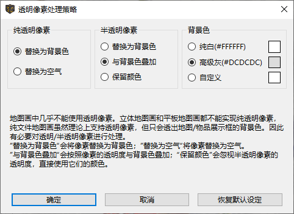
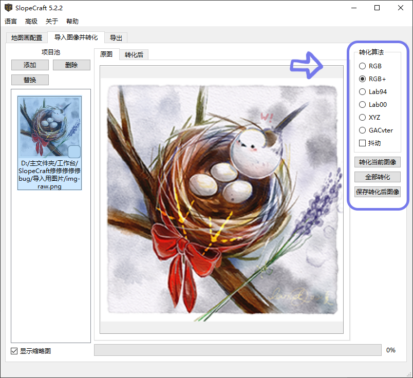
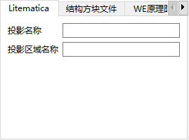
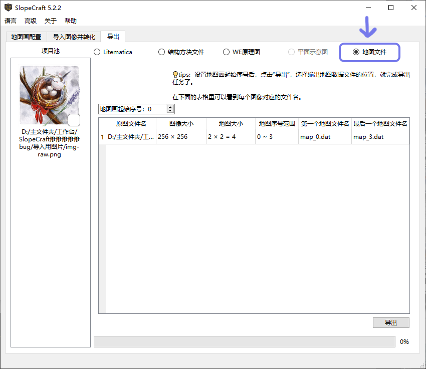
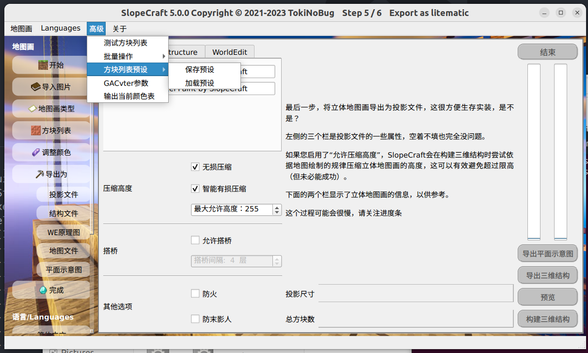

# SlopeCraft 教程

这个文档将会详细讲解如何使用 SlopeCraft 创建立体、平板和纯文件地图画，  

为了消除歧义，这里规定几个术语的含义：

|   术语   | 含义                                                 |
| :------: | :--------------------------------------------------- |
|   地图   | Minecraft 中的物品，id 为 `minecraft:filled_map`        |
|   存档   | Minecraft 中的游戏存档                                |
|  地图画  | 显示于地图物品中的图像                               |
| 地图文件 | 存储地图数据的 nbt 二进制文件，文件名形如 `map_<i>.dat` |

!!! tip "tip"
    在菜单栏的 语言 下拉菜单中你可以找到切换语言的选项。  

## Step 0. 图片预处理

首先，准备好你想要制作成地图画的原图。这里使用的图像是[Lancet_Corgi 画的图](https://t.bilibili.com/544583492149793294)，感谢刀哥的许可。

用 ps 或者其他可以编辑图片的软件，**将它的长宽缩放到 128 像素的整倍数**。

这里我将图片缩放到 256×256 像素，这恰好是 2×2 地图的大小。


(调整大小**不是强制的**，SlopeCraft 也不包含缩放图片的功能，但我很建议这样做)

将这张图片保存好。

## Step 1. 地图画配置

双击启动 SlopeCraft.exe，你将会看到如下的界面。


上方的三个页面标签代表着制作地图画的三个步骤：

1. 地图画配置
2. 导入图像并转化
3. 导出

在本软件外还有着第四个步骤：将文件导入游戏

此时你应该处于地图画配置界面，在这个界面，你需要完成三个小步骤，下面分别进行详解：

### 1.1 选择游戏版本

你需要设置地图画对应的游戏版本。

目前从 1.12～1.20 都是支持的，我会继续跟进更新的版本，但不会支持 1.12 以前的老板本。

需要注意，1.12~1.15 版本的地图画的“画质”没有区别，平板地图画有51 色，立体地图有153 色。1.16 为阴间树增加了 7 种基础颜色，所以平板地图画可以使用58 色，立体地图画则可以使用174 色。1.17 增加了深板岩、生铁块和发光地衣的颜色，因此平板可以使用 61 色，立体地图画可以用 183 色。

> *吐槽：Mj 为啥要给阴间树这么多颜色？多来点肉色不好吗？*

### 1.2 选择地图画的类型

这里需要你选择**地图画的类型**：

- **立体地图画**：可以做到**颜色尽量丰富**、**画质尽量精致**，代价是建造困难。
- **平板地图画**：传统的地图画类型，**画质一般**，建造较简单。
- **纯文件地图画**：原版地图画能达到的**极限画质**，无法建造，一般只能通过指令获得。如果你不需要让地图画在游戏中以方块的形式存在，只需要让它显示于地图、并能被贴在物品展示框中，那么请选择此项。

    请注意，这种纯文件地图画在使用时至少需要替换存档中的文件，有可能还需要使用命令。一般只适用于单机游戏，如果你是服务器管理员也可以。

这里我选择了立体地图画。

### 1.3 设置方块列表

方块列表其实就是一个地图画的“**材料表**”，或者“**调色盘**”。**它决定了地图画的调色盘中一共有哪些颜色，每种颜色又对应哪种方块。**

这个页面比较复杂，我将依次介绍每个部分。**（其实一般来说，方块列表都不太需要自己调整）**


滑动区内显示了每一种基础颜色。在**启用**框中，你可以勾选**是否允许 SlopeCraft 使用这种颜色**。默认情况下，除了**水**，每种可用的基础颜色都会被勾选（低版本部分颜色不可用）

启用框的下方是**每一种颜色所对应的方块**。调色盘中的每一种颜色都只能使用一种方块。

- 你可能认为图中很多方块的颜色不同，但请注意，**它们在“地图的眼睛”里是完全相同的**，选择的唯一依据就是方块是否容易量产。
- 有些基础颜色只有一种方块可用，然而调色盘不能空缺，所以这个选项是不可更改的，就像图中的玻璃或*绿宝石块(未在图中)*，它必须被选中。


上方有四种方块列表预设可供选择：

- Vanilla 是“**原汁原味**”的，尽量使用每种颜色“原先的方块”。它比较适合创造模式，不适合生存实装
- Cheap 极力选择**最便宜的方块**，保证每种方块都是可以量产的。它适合生存前期。
- Elegant 是在可以生存实装的情况下，尽量选择“**最优雅的方块**”，比如尽量选择小黑偷不走的、既好看又不太难量产的方块。这是默认的选项。
- Shiny **专为光影而生**，它尽量选择发光的方块，力求在光影中足够绚丽。
- Custom 则代表你使用了**自定义**的方块列表。

**方块列表预设中会显示这张地图画可以使用多少种颜色。** 如果你禁用了某些基础颜色，那么这个数量会减少一些。**所以调色盘越丰富，地图画尺寸越大，画质就越好。**

右上角的**优先使用混凝土**等按钮方便批量操作，意思很明显，不再多解释。

#### 保存与加载预设

你可以将当前的方块列表导出，方便下次加载使用。文件采用 json 存储，后缀名是`.sc_preset_json`。

______________________________________________________________________________________________________________

完成这些设置之后，点击顶部的“**导入图像并转化**”菜单页，进入下一步

## Step 2. 导入图像并转化
在这个界面中，你需要完成两个小步骤：导入图片，并将其转化为地图画。


### 2.1 导入图像

??? question "“项目池”是什么？"  
    SlopeCraft在5.10版本引入了新功能：“**项目池**”，  
    你导入的每一张图片都会被程序创建为一个项目，后续的各种转换操作会为项目添加数据 。  
    *~~（没用的知识增加了(=・ω・=)！）~~* 。

    项目池的操作逻辑和系统文件管理器类似：选中单个图片，预览或进行相应操作

    简单来说，你现在可以很方便地进行批量操作了！  
    **注意：同一批图像只能使用一种转换算法，风格、颜色差异大的图建议分批操作！**

在项目池中，点击**添加**就可以导入**一个或多个**预处理后的图像，

如果你的原图有透明或半透明像素，会自动弹出设置**透明像素处理策略**的界面，详细说明如下：



透明像素处理策略有不同的方法处理纯透明像素（alpha=0）和半透明像素（alpha>0）。纯透明像素要么替换为背景色，要么设为空气；半透明像素既可以替换为背景色，也可以与背景色叠加融合，还可以忽略掉它的透明度属性，直接当做不透明像素。另外也可以设置背景色，默认背景色是雪块平铺时的浅灰色，也可以选择纯白色，或者任何自定义颜色。

**请注意：透明像素会在导入时完成处理，如果你对处理的结果不满意，请删除项目池中的项目，重新导入图片。**

图片导入完成后，左侧的项目池中会显示出对应的项目，选中相应的项目以进行预览

### 2.2 转化图像

完成上述前置工作后，我们该进入正餐了：将图像转化为地图画。



#### 挑选转化算法

**转化当前图像**按钮会将图像的颜色调整为地图画的调色盘中可以使用的颜色，而预览框上面的 **原图** 和 **转化后** 分别显示原图和调整后的地图画，方便你对比。

上面的转化算法有 6 种选项， **代表 6 种调整颜色的方式**。 **抖动** 则使用 Floyd-Steinberg 算法，尝试用几种相近的颜色掺混，试图更好的贴合原图。

前五种转化算法分别对应着五种不同的色差公式。算法中 RGB+ 最为推荐，RGB 和 XYZ 速度最快，Lab94 和 Lab00 效果较好但性能较慢。GACvter 是最慢的，但如果前 5 种算法效果都不满意，不如试试它。

前 5 种算法只考虑像素的颜色，不考虑像素空间位置，它们称之为传统算法。而第 6 种算法 GACvter 则以前 5 种算法生成的结果作为“种子”，在其基础之上寻找边缘轮廓更贴近原图的解。这个新算法同时考虑像素颜色和位置，是智能算法。

对于同一张图像，这 6 种调整方式的效果都是不同的。

我们都希望地图画与原图尽量接近，所以你可以依次试一下每一种调整方式，通过两个按钮来回比较，选出调整效果最好的一种。

|  |  |
| :-------------------------------------------------------------------------: | :-------------------------------------------------------------------------------: |
|                                   转化前                                    |                                      转化后                                       |

调整图片的过程可能会比较慢，尤其是对于比较大的图片。 **如果进度条突然停滞不前，甚至窗口未响应，请不要关闭窗口，什么都不用做，耐心等待即可。** 调整图片的过程有大量的计算任务，卡顿是正常的。

#### 转换全部图像（批量处理特殊操作）

当你选出最喜欢的一种算法后，请点击**全部转化**按钮转化项目池内所有项目，转化完毕的项目右下角应该会有✔

______________________________________________________________________________________________________________

转化完所有图像后**（确保每个项目右下角都有✔）**，就要进入生成地图画的最后一步了：**导出**。

## Step 3. 导出

导出有 6 种类型，以下的表格记录了各种地图画类型与导出类型之间的关系。

|            导出类型             | 立体地图画 | 平板地图画 | 纯文件地图画 |
| :-----------------------------: | :--------: | :--------: | :----------: |
| Litematica 投影（\*.litematic） |     ✔      |     ✔      |              |
|   原版结构方块文件（\*.nbt）    |     ✔      |     ✔      |              |
|      WE 原理图（\*.schem）      |     ✔      |     ✔      |              |
|     地图数据文件（\*.dat）      |     ✔      |     ✔      |      ✔       |
|   转化后图像（\*.png \*.jpg）   |     ✔      |     ✔      |      ✔       |
|   平面示意图（\*.png \*.jpg）   |            |     ✔      |              |

**注意：WE 原理图（\*.schem）只支持 1.13+版本，在 1.12，WE 使用 \*.schematic 后缀的旧原理图格式，SlopeCraft 目前不支持该格式。**

在导出界面选择你需要导出的类型，并进行相应设置

由于[前四种导出类型](#3a-litematica-we "跳转到对应部分")涉及三维结构，设置和[地图文件类型](#3b "跳转到对应部分")有较大不同，下面分别进行介绍  
（点击类型名称可以空降）

### 3.a 导出为 Litematica 投影 / 原版结构方块文件 / WE 原理图 / 平面示意图


#### 压缩高度（对平板地图画无效）

SlopeCraft 支持两种压缩方式：有损和无损。

简单来说，无损压缩是在**严格保证每个像素颜色不变**的前提下，以连续性为代价，压缩地图画总高度，但它约束较大，未必如愿。毫不夸张的说，有些图片是不可压缩的，比如纯白色的部分。这时候就需要新的压缩技术：智能有损压缩。

有损压缩则**微调个别像素的颜色**，压缩地图画总高度，使其小于等于用户指定的最大允许高度。有损压缩使用遗传算法实现，属于群体人工智能，是目前 SlopeCraft 中技术含量最高的模块。最大允许高度不要低于 14，否则立体地图画很可能压缩失败。

一般来说，有损压缩的最大允许高度越小，画质损失越明显。如下，这张图若做成立体地图画，高度是 255 格，现在进行有损压缩（同时启用无损压缩）。图 1 为最大高度 100 格时的构建结果，图 2 为最大高度 20 格时的构建结果。

|  |  |
| :------------------------------------------------------------------------------------------: | :----------------------------------------------------------------------------------------: |
|                                             图 1                                             |                                            图 2                                            |

压缩前后图片没有显著变化，画质损伤不明显。但仔细观测仍可以发现，左右两侧留白部分出现了一些灰点，且图 2 由于压缩程度高，灰点较图 1 更多。另外，遗传算法是一种随机优化算法，被修改像素有一定随机性，不会呈现明显的规律图样。

有损压缩和无损压缩可以搭配使用，也可以分别独立使用。但一般来说，如果启用了有损压缩，没道理不启用无损压缩。纯有损压缩需要修改更多的像素，对画质的损伤会比较大，无损压缩能在修改像素更少的情况下完成压缩任务，很大程度上减轻画质损伤。

平板地图画可以勾选这两个选项，但**不会发挥任何作用**。

#### 搭桥

立体地图画的每个水平截面上都有很多分散的方块，极不方便建造，倘若能用多条通路连接这些分散的方块，无疑能让建造更加容易。搭桥就是在一个水平面内用玻璃方块连接所有方块，形成通路从而辅助玩家建造的过程。

毫无疑问，搭桥会消耗额外的玻璃，因此不推荐在立体地图画的每一层都执行搭桥。默认每间隔 4 层搭一次桥，你也可以修改这个间隔。间隔过大，辅助搭桥的效果会减弱；间隔过小，浪费玻璃。

有关地图画压缩和搭桥的详细信息，可阅读[地图画原理](./principles-introduction.md)。

[AbrasiveBoar902](https://github.com/AbrasiveBoar902) 为优化搭桥性能提供了极大帮助，感谢他的帮助。

#### 其它选项

- **防火/防末影人：**  顾名思义，这是在保护可燃方块，并避免小黑偷东西。具体方法是用玻璃包裹这些方块的每一个暴露在外的表面，亲测有效。不过这也同时会耗费大量的玻璃，需要谨慎选择。

- **连接蘑菇块：** SlopeCraft 生成的地图画中可能包含多个相邻的蘑菇块（包括红蘑菇块、棕色蘑菇块、蘑菇柄方块），它们互相接触的面应当是气孔面，在生成的投影中却不是。这个功能将搜索所有相邻的蘑菇方块，将它们互相接触的面修正为气孔面。

#### 额外的导出选项

前四种导出类型分别可以输入额外的导出选项、附加额外的元信息，下面逐一介绍。

- **Litematica 投影的导出选项**

    在 投影名称 和 投影区域名称 栏中，可以填入投影文件的信息。但这不是强制的。

    

- **原版结构方块文件的导出选项**

    原版结构方块文件采用稀疏矩阵的方式存储，没有存储的地方是结构空位。这种存储方式使得结构方块文件是原版兼容性最好但压缩率最差劲的格式。

    

    因此结构方块文件就有了两种存储空气方块的选择：当作结构空位，或者如实存储。当作结构空位可以极大的节省空间，但在结构方块中粘贴出来时，不能覆盖掉其他的非空气方块；按空气方块存储可以克服这个问题，但文件体积会很大。

- **WE 原理图的导出选项**

    

    WE 原理图的属性略多，它们是对 WorldEdit 生成的原理图逆向工程得来的，直接对应着同名的 nbt 标签。我并不清楚这些元属性对原理图有怎样的影响，因为我几乎不使用 WE。

- **导出平面示意图**

    

    设置导出的示意图是否包含分割线、以及分割线的间距。

#### 预构建三维结构进行预览（可选）

点击 **预构建三维结构** ，SlopeCraft 会使用当前设置将地图画预构建为三维结构，并将投影的尺寸和总方块数显示出来。

**预构建的三维结构仅用于预览，并不用于导出。**

**请注意，如果投影 y 尺寸超过了 256 / 384[^height] ，那么千万千万不要继续导出。一个超过限高的投影是没有任何意义的！**

[^height]: 不同版本、不同维度的建筑高度会有不同。详情请查阅[Wiki](https://zh.minecraft.wiki/w/%E9%AB%98%E5%BA%A6)

预构建三维结构后，可以进行下面两种详细预览

- 预览压缩效果：有损压缩有可能进一步改变图像，在此可以检查图像的状态。
- 预览材料表：预览材料的数量信息

|  |  |
| :-----------------------------------------------------------------------------------------: | :---------------------------------------------------------------------------------------: |
|                                         预览地图画                                          |                                          预览材料表                                           |

#### 全部导出

确认设置无误后，就可以点击 **全部导出** ，选择相应的**文件夹**用于导出所有文件（批量操作时建议使用空文件夹）。

______________________________________________________________________________________________________________

### 3.b 导出为地图 (数据) 文件

点击**地图文件**选项，跳转到对应的界面。



这个页面显示了地图画对应地图的行数、列数、文件数量和将要导出的地图文件的文件名。

#### 设置地图文件的初始序号

地图文件的文件名形如 map_i.dat，其中 i 是大于等于 0 的整数，如 map_3.dat。**i 就是这个地图文件的序号。序号实际上是地图文件的唯一标识符**。正常情况下，我们生成的地图文件不应该覆盖掉无关的地图文件，所以设置初始序号需多加注意。

在游戏中按下 <kbd>F3</kbd> + <kbd>H</kbd> 可以查看物品的详细信息，**包括地图物品的 Id，也就是对应的地图文件的序号**。下图中显示的地图物品对应名为 map_6.dat 的地图文件。


有以下两种方法获得地图，选择一种你喜欢的。后续的导入游戏方式也会有区别，请注意！

- 如果你想通过/give命令来获得地图：

    起始序号可以随意设置，只要不覆盖掉无关的地图。

- 如果你不想使用命令，只替换地图文件：

    **1.** 先创建与地图画对应的`n`个地图，n 就是 SlopeCraft 显示的地图文件数量，在本例中是 4。

    **2.** 在游戏中按下 <kbd>F3</kbd> + <kbd>H</kbd> ，查看地图文件对应的序号。这些地图对应的序号应当是 `a`~`(a+n-1)` ，共 n 个。

    **3.** 退出世界，在 SlopeCraft 的**地图文件起始序号**栏中填入`a`的值。

确认设置无误后，就可以点击 **导出** ，选择相应的**文件夹**用于导出所有文件（建议使用空文件夹）。  

______________________________________________________________________________________________________________

## Step 4. 将地图画导入到游戏中

空降：| [导入 Litematica 投影](#litematica "跳转到对应部分") | [导入结构方块文件](#_11 "跳转到对应部分") | [导入 WE 原理图](#we "跳转到对应部分") | [导入地图文件](#_12 "跳转到对应部分") |

### 导入 Litematica 投影

打开刚刚导出文件的文件夹，将导出的投影文件移动到.minecraft[^ifChange0]/schematic 文件夹下。然后打开 Minecraft，进入存档/服务器，在你想要创建地图画的地方导入这个投影。

放置投影的时候请注意，**投影原点的 x 和 z 坐标必须为 `-65+k×128`，其中 k 为任意整数**。y 坐标则任意。如 (63,62,-65)。只有这样，**地图画才能与地图的网格对齐**。

然后开始实装这个投影，或者直接粘贴原理图。完成之后，在地图内部创建新的地图。每个地图都应当是无缩放的，因为每个像素点对应一个方块。将它们按次序摆在物品展示框内，大功告成。

- 如果是一个 2×2 地图的地图画，那么你应当创建 2×2，即 4 个地图。
- 如果你的游戏版本是 1.14 及以上，那么最好在制图台内用玻璃片将地图锁住。

### 导入结构方块文件

结构方块的目录为.minecraft[^ifChange1]/saves/<游戏存档名>/generated/minecraft/structures

如果你没有找到这个目录，说明游戏还没有创建，你可以手动创建这个目录并把文件复制进去。

之后加载结构的时候请注意：**结构原点的 x 和 z 坐标必须为 `-65+k×128`，其中 k 为任意整数**。y 坐标则任意。如 (63,62,-65)。只有这样，**地图画才能与地图的网格对齐**。

结构方块具体使用方法比较复杂，这里不再赘述，请看[B站教程](https://www.bilibili.com/video/BV1ro4y1m7xv)

### 导入 WE 原理图

World Edit原理图的目录为.minecraft[^ifChange2]/config/worldedit/schematics

如果目录不存在，说明游戏还没有创建，你可以手动创建这个目录并把文件复制进去。

之后可以在游戏中，使用`//schem load <原理图名称>`命令导入原理图。具体操作参见World edit教程，比如[这个](https://www.mcmod.cn/post/3050.html)

### 导入地图文件

打开刚刚导出文件的文件夹，将导出的地图文件移动到.minecraft[^ifChange3]/saves/<游戏存档名>/data 文件夹下。

可能会有“替换或跳过文件”窗口弹出，如果担心无关的地图被覆盖掉，可以先暂且不选，继续往下看。

- 通过/give命令来获得地图：

    这种方式**不应该**弹出“替换或跳过文件”窗口，如果弹出，请关闭窗口，并检查地图序号是否有冲突。

    - 在 1.12，使用 `/give @s filled_map 1 i` 来获得序号为 i 的地图。
    - 在 1.13+，使用 `/give @s filled_map{map:i}` 来获得序号为 i 的地图。

- 不使用命令，只替换地图文件：

    **1.** 刚刚移动文件时**应该会**弹出“替换或跳过文件”窗口，点击“替换目标中的文件”选项替换文件。

    **2.** 打开游戏，这`n`个地图应当已经被成功的替换为地图画。

[^ifChange0]: 如果你修改了游戏目录，应将 **“.minecraft”** 替换为相应目录
[^ifChange1]: 如果你修改了游戏目录，应将 **“.minecraft”** 替换为相应目录
[^ifChange2]: 如果你修改了游戏目录，应将 **“.minecraft”** 替换为相应目录
[^ifChange3]: 如果你修改了游戏目录，应将 **“.minecraft”** 替换为相应目录

## 🛠 高级功能



在“高级”目录内可以看到一些高级操作。下面将逐一介绍。

### GA转化器参数

GACter 使用遗传算法（GA），你可以设置它的参数。


如果你了解 GA，那这些参数不需要解释。如果不了解，百度一下，或者干脆别动它。

唯一需要解释的参数就是**最大提前收敛代数**，它指的是最大允许的连续寻优失败代数。举个例子，如果它的值是 50 代，那么当算法连续 50 代没有找到更优秀的解时，算法终止，节省时间。更大的**最大提前收敛代数**可以避免算法早熟，但会让它更慢。

### 缓存

SlopeCraft 采用缓存减少转化多张图片时的内存占用，正常情况下，磁盘上的缓存将在 SlopeCraft 退出时被自动清理，用户完全不需要关心缓存。不过SlopeCraft也允许用户手动清理缓存文件。

### 测试方块列表

投影中方块缺失基本上都是**id 拼写错误**造成的。如果你一次性导入很多方块，这个功能可以快速测试出方块列表中每个方块有没有 id 错误。

测试方块列表会生成一个特殊的结构方块文件，包含每种基色拥有的每一种可用方块（因版本不符合的除外）。结构文件中每个方块均按方块列表中的顺序排列。

如果一切正常，不会有任何一个方块缺失；反之则说明对应的方块存在 id 错误。

下面的图显示了效果。由于投影很长，分成两段截图。

|  |  |
| :------------------------------------------------------------------------: | :-------------------------------------------------------------------------: |
|                                   左半段                                   |                                   右半段                                    |

### 输出当前颜色表

这个菜单项允许用户将当前的颜色表输出为一个$16\times 16$的 png 图像，包含了当前可以使用的所有颜色。

|  |  |  |
| :--------------------------------------------------------------------------: | :----------------------------------------------------------------------------: | :--------------------------------------------------------------------------------: |
|                                  1.19 立体                                   |                                   1.19 平面                                    |                                    1.19 纯文件                                     |

??? question "有什么用？"
    输出颜色表实际上就是导出“色板”，以便于像素画创作

    如果你想要自己作画，并用在游戏里，请遵循以下步骤，避免发生意料之外的错误：

    1. 首先要完成“地图画配置”页面的设置，这样才能输出你想要的颜色表
    2. 在高级设置内导出颜色表
    3. 将颜色表导入到相应的图像处理软件，进行创作，并导出图像
    4. 再次进行“地图画配置”页面的设置(如果你关闭过软件的话)，并导入图像
    5. 在转换图像时，选择RGB+算法，**不要**勾选抖动
    6. 剩下的导出步骤就和普通流程一样了，参见[上文](#step-3)

______________________________________________________________________________________________________________

## 🛠 自定义方块列表

如果你不满足于我预设的那些方块，想要自己添加其他的原版方块甚至 mod 方块，这一章会告诉你怎么在 SlopeCraft 中添加并使用自定义的方块。

### 前置信息

你需要掌握方块的以下信息：

1. 方块的**完整**id，包含**命名空间前缀**以及**所有方块属性**。

      如涂蜡铜块上半砖：

      ```file
      minecraft:waxed_copper_slab[type=top,waterlogged=false]
      ```

      这里面`minecraft:`是原版方块的命名空间前缀，中括号里的内容是所有方块属性。保险起见，你应当给每个方块属性都设置对应的值。

2. 方块最早出现的游戏版本

      SlopeCraft 在方块列表中约定了以下几个值代指大版本：

      | 数字  |   版本    |
      | :---: | :-------: |
      |   0   | 早于 1.12 |
      |  12   |   1.12    |
      |  13   |   1.13    |
      |  14   |   1.14    |
      |  15   |   1.15    |
      |  16   |   1.16    |
      |  17   |   1.17    |
      |  18   |   1.18    |
      |  19   |   1.19    |
      |  20   |   1.20    |
      |  255  | 未来版本  |

      正常情况下，你不应该使用 255，它只是一个预留的值。如果你非要给一个方块指定为未来版本，那么导致的一切都属于未定义特性——我也不知道会发生什么。

3. 方块在 1.12 的 id

      添加这个属性是因为 Mojang 从 1.12 更新到 1.13 修改了相当多方块的 id。如果你要添加的方块在 1.12 未添加，或者 id 没有改变，可以填空字符串。

4. 方块的基色

      这可能是最容易出错的地方。对于原版方块，你可以查询[Minecraft Wiki](https://zh.minecraft.wiki/w/%E5%9C%B0%E5%9B%BE%E7%89%A9%E5%93%81%E6%A0%BC%E5%BC%8F#%E5%9F%BA%E8%89%B2)。如果是 mod 自定义的方块，要么自己想办法测，要么去问 mod 开发者。

      如果不懂什么是基色，去看[地图画原理](./principles-introduction.md)

5. 方块中文名称
6. 方块英文名称
7. 方块的下方需要依附其他方块
8. 方块是否发光
9. 方块是否可燃
10. 方块是否可被末影人偷走
11. 方块的材质图片（建议为一张 16*16 像素的 png 图片）

### 方块与方块列表

SlopeCraft 中，方块列表以 json 格式存储，相关的图片放在 FixedBlocks 和 CustomBlocks 文件夹下。

方块列表分为两类：固定方块列表与自定义方块列表。其中固定方块列表是我提供的最基础的一些方块，存储与**FixedBlocks.json**中（对应的图片在**FixedBlocks**文件夹下），确保每个基色都存在对应的方块。虽然方块列表中的方块事实上是在程序运行时才确定，但**你不应该修改它**。

自定义方块列表存储在**CustomBlocks.json**中，相应的图片在**CustomBlocks**文件夹下，这是用户自定义的方块列表，允许用户灵活编辑。我在里面写了一些半砖方块，可以作为参考。

每个方块拥有以下属性：

|      属性名      |  类型  | 是否必填 |  默认值  | 说明                                |
| :--------------: | :----: | :------: | :------: | :---------------------------------- |
|    baseColor     |  byte  |    是    |          | 方块的地图基色                      |
|        id        | string |    是    |          | 方块 id，包括命名空间和详细方块状态 |
|     version      |  byte  |    是    |          | 方块最早出现的版本。                |
|      nameZH      | string |    是    |          | 方块的中文名                        |
|      nameEN      | string |    是    |          | 方块的英文名                        |
|       icon       | string |    是    |          | 方块对应图片的文件名                |
|      idOld       | string |    否    | 空字符串 | 方块在 1.12 的 id                   |
|    needGlass     |  bool  |    否    |  false   | 指示方块底部是否必须有其他方块      |
|    isGlowing     |  bool  |    否    |  false   | 指示方块是否发光                    |
| endermanPickable |  bool  |    否    |  false   | 指示方块是否可以被末影人偷走        |
|     burnable     |  bool  |    否    |  false   | 指示方块是否可以被烧毁              |

**属性 wallUseable 已经被移除，因为墙面地图画已经被移除。**

用 json 格式表示如下：

```json
{
  "baseColor": 11,
  "id": "minecraft:cobblestone_slab[type=top,waterlogged=false]",
  "nameZH": "圆石台阶",
  "nameEN": "Cobblestone slab",
  "icon": "cobblestone_slab.png",
  "version": 0,
  "idOld": "minecraft:stone_slab[half=top,variant=cobblestone]"
}
```

上面这段 json 信息展示了一个圆石上半砖的方块信息，解析如下：

1. 它的基色是 11，这也是圆石、石砖、石头的基色。
2. 它的方块 id 是“minecraft:cobblestone\_slab[type=top,waterlogged=false]”，中括号里的方块状态指出这是个上半砖，且不含水；
3. 它的中文名是“圆石台阶”，英文名是“Cobblestone slab”；
4. 它的图片是一个名为“cobblestone_slab.png”的图片，这个图片放在 CustomBlocks 文件夹下；
5. 它最早出现的版本为 0，代表它在 1.12 之前就已经加入；
6. 由于它的方块 id 在 1.13 发生了变化，它在 1.12 的方块 id 为 idOld 的值。

<!-- https://cdn.jsdelivr.net/npm/sakana-widget@2.7.0/lib/sakana.min.css -->
<!-- https://cdn.jsdelivr.net/npm/sakana-widget@2.7.0/lib/sakana.min.js -->
<!-- https://cdnjs.cloudflare.com/ajax/libs/sakana-widget/2.7.0/sakana.min.css -->
<!-- https://cdnjs.cloudflare.com/ajax/libs/sakana-widget/2.7.0/sakana.min.js -->

<link
  rel="stylesheet"
  href="https://cdn.jsdelivr.net/npm/sakana-widget@2.7.0/lib/sakana.min.css"
/>
<div id="sakana-widget"></div>
<script>
  function initSakanaWidget() {
    new SakanaWidget().mount('#sakana-widget');
  }
</script>
<script
  async
  onload="initSakanaWidget()"
  src="https://cdn.jsdelivr.net/npm/sakana-widget@2.7.0/lib/sakana.min.js"
></script>

*你发现了世界的尽头(=・ω・=)，奖励你一个石蒜*
