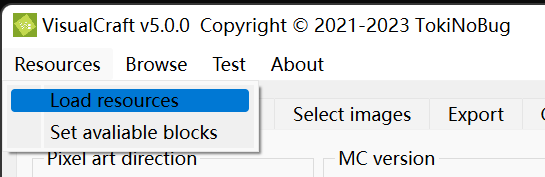
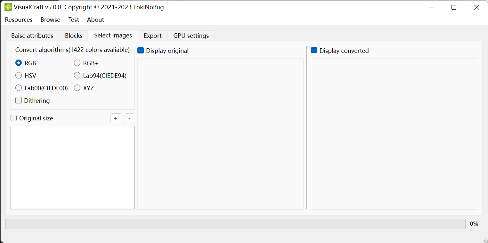

# VisualCraft Tutorial

## Description

VisualCraft is a brand-new pixel art generator for Minecraft. It is developed by TokiNoBug, and is a subproject of SlopeCraft. Unlike other counterparts, VisualCraft aims to catch up with latest versions of Minecraft(from 1.12 to latest), providing greatest functions and supporting as much MC features as possible.

Now VisualCraft is able to parse many 3rd party resource packs and allowing to add custom new blocks. Different from traditional methods, VisualCraft understands resource packs by parsing block models, which is rather similiar with what Minecraft does. Thus custom block models are supported.

When it comes to export, VisualCraft supports multiple formats, like Litematica mod(**\*.litematic**), WorldEdit schematic(**\*.schem**)(1.13+ only), vanilla structure block file(**\*.nbt**), flat diagram image(**\*.png**) and so on.

VisualCraft composes half-transparent blocks to produce more colors. No greater than 65534 colors are supported, and thus the maximum layers should now exceeds 3.

The great amount of colors makes GPU accleration necessary. Now OpenCL is supported, but it can also run on CPU only.

## Step 0. GPU settings

This step is not compulsory. You can skip it, but if your image is huge, or you want to export a pixel art of 3 layers, this may help you make VisualCraft faster.


Uptil now there are 2 compute options: CPU threads and compute device.

In the spin box you can set the cpu threads. By default the value is the logical thread number of you CPU, retrieved from `std::thread::hardware_concurrency()`. You can set it a little bit greater so that it may make a better use of CPU cores, but too many threads are extra burdern to thread scheduler, which will supress overall time and increase energy cost.

The next combo box helps you to select a compute device. This device is only used during image convertion. All avaliable devices are listed in the right tree widget. Devices are classified by platforms. Now only OpenCL is supported. And for MacOS that has already discard OpenCL, I'm planning to support Metal, but it takes time.

If VisualCraft is built without GPU API, only CPU is avaliable, and GPU boosting will not be accessable.


## Step 1. Basic Attributes


On the first page you can setup basical attributes. Pixel art directions and Minecraft versions can be set on the left side, while **biome**, **max layers** and **transparent leaves** can be set below.

It is necessary to explain the last three options:

1. **Max layers** refers to the maximum block layers of the pixel art, since VisualCraft supports superimposing transparent blocks on non-transparent blocks. 
   - Max layers should be a positive number, and no greater than 3, otherwise the number of blocks will exceed 65534, beyond the capacity of `uint16_t`.
2. **Biome** refers to what biome the pixel art will be built in. In Minecraft, the colors of grass, leaves and vines differs in biomes, so it is necessary to input the biome.
3. **Transparent leaves** refers to whether leaves are treated as transparent blocks. 
   - The apperaence of leaves are different by render options. If the graphics quality is not fast, leaves are transparent blocks that can be see through, otherwise they are not transparent, and transparent pixels in their textures are replaced with black(`0x000000`).


Resource packs and block state list(BSL) jsons can be set on the right side. Resource packs are zips that Minecraft receives, and BSL are json files storing block informations. Only blocks recorded in BSL can be used by VisualCraft.

Resource packs and BSL are represented in two list widgets. Click **Add** and you can select a file and add it to the list. To remove one or more items from the list, select them and click **Remove**. Note that only selected items can be removed. You can sort items by dragging them.  If you hope to use an item, turn on its checkbox, otherwise turn it off. When multiple resource packs are parsed, they stack in the represented order, like what Minecraft does. Multiple BSL jsons are parsed similiar.

 `Vanilla` and `Default` are special items that can not be removed, because they represent fundamental resource pack and BSL respectively. But you can still disable them, by turing off their checkbox.



 If you have finished basic attributes, find **Resource** menu and click **Load resources** to load resources.

## Step 2. Allowed Blocks


After you load resources, all avaliable blocks will appear on the second page. Blocks are separated by classes. You can select or deselect any block and any classe.

### Hot Keys
On the left there are several hot keys to help you select and deselect blocks.

|          Key name          | Description                                                              |
| :------------------------: | :----------------------------------------------------------------------- |
|         Select all         | Select all blocks                                                        |
|        Deselect all        | Deselect all blocks                                                      |
|  Disable non-reproducible  | Deselect all non-reproducible blocks                                     |
|    Disable rare blocks     | Deselect all rare blocks                                                 |
| Select reversely classwise | Reverse the selection for each class, no block selection will be changed |
| Select reversely blockwise | Reverse the selection for each block, no calss selection will be changed |
|          Advanced          | Show a subwindow to select or deselect blocks according to custom rules  |


After you finished this page, find **Resource** menu and click **Set avaliable blocks** to setup those selected blocks.

## Step 3. Load images




Acutally, for least operations, the only thing you need to do is to add images, and go the the next page. In this paragraph I will introduce widgets on this page.

After you setup selected blocks, the number of colors will be shown after **Convert algorithms**.

There are several algorithms that can convert images into pixel arts. VisualCraft and SlopeCraft share the same alogrithms implementation, so these options are the same. The only difference is that VisualCraft can be boosted by GPU since it may have to deal with more than 10 thousands of colors and much larger images.

The logic of importing images are similiar than resource packs and BSLs. Click **+** to add images and **-** to remove selected images. VisualCraft is born to process multiple images, so all images are placed in a list. If you click a image, it will be displayed and converte.

You can change the display options. Turn on **Original size** to force all images displayed by their original size, regardless of label size. Toogle **Display original** and **Display converted** to determine whether to show corresponding image or not.


## Step 4. Export


In this page you can tell VisualCraft how to export pixel arts and images. 5 export types are supported.

|      Type       | Filename Extension | Description                                        |
| :-------------: | :----------------: | :------------------------------------------------- |
|   Litematica    |    \*.litematic    | Litematica mod schematic                           |
| Structure file  |       \*.nbt       | Vanilla structure block file                       |
|    WE schem     |      \*.schem      | WorldEdit mod schematic (1.13+)                    |
| Converted image |   \*.png \*.jpg    | The image after convertion                         |
|  Flat diagram   |       \*.png       | A diagram replacing each pixel with related block. |

Since VisualCraft are designed to execute batch operation, you can set which directory to put generated simply by choose a type in the combox and then click **Set export directory**. This operation will fill the related coloumn with exported filename.

If you hope to change how to edit, just change the export table. From the third to the seventh coloumn are editable. 

When you click **Start**, VisualCraft will execute according to the table. If a cell is empty, it will be skipped; otherwise the filename in this cell will be parsed. If the extension name is incorrect, an error may occur. 

It's worth to note that flat diagram may consist of multiple images because a pixel art may have multiple layers. So the text in the cell is actually a list of filenames  seperated by semicolon '`;`'. For example :

```bash
# For double layer
D:/image00_layer0.png;D:/image00_layer1.png
# For triple layer
D:/image01_layer0.png;D:/image01_layer1.png;D:/image01_layer2.png
# For single layer
D:/image01_layer0.png
```

If the number of semicolons are incorrect, errors will occur.

### Export options


In this page you can set attributes of exported files. The options of Litematica, Vanilla structure and WE schem is same as that in SlopeCraft. While flat diagram options are worth to explain.

Since flat diagram represent the whole pixel art by blocks, it will be useful to draw horizontal and vertical lines to split the whole image into chunks. By default split lines are drawn by every 16 blocks, which is the size of a Minecraft chunk. You can change the margin in spinboxed, or toogle the checkboxes to disable split lines.

The flat diagram are generated by libpng, and it's really a large image, so you can tell libpng how to compress the image by **png compress level**. The two level numbers are in range [0,9]. A larger compress level means better compression and more encoding time, and a greater memory level means more memory to use. **If you are not familiar with image and file compression, just keep the default value**.